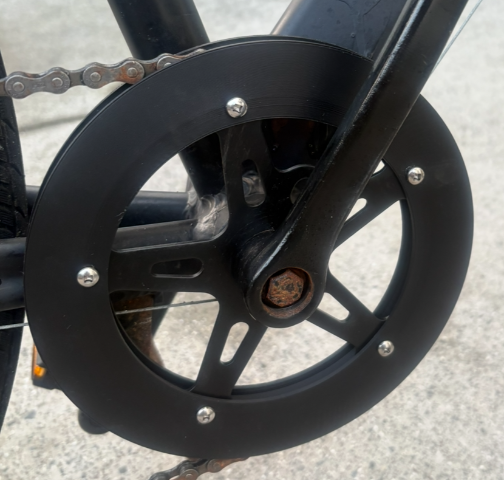
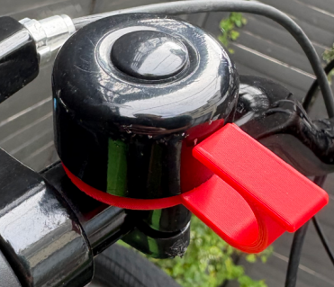
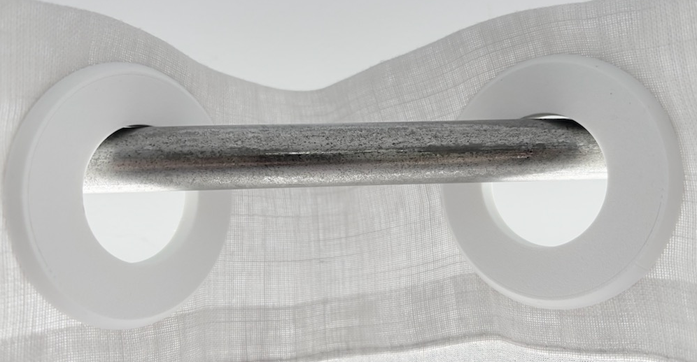
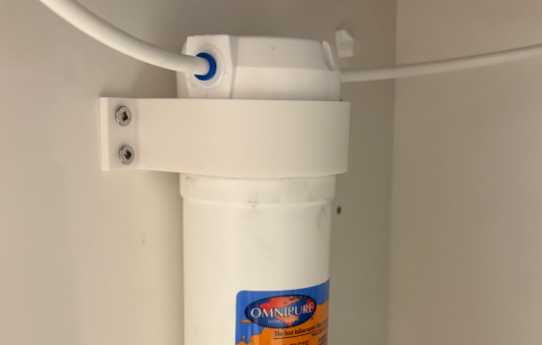

# Miscellaneous 3D printables
Miscellaneous cycling and household items for 3D printing.
Mostly parametric, built with [FreeCad](https://github.com/FreeCAD/FreeCAD)

## Cycling
|||
|-|-|
||Chainring guard with 5 holes for 170 W/ x 44T Crankset|
||Clapper for standard bike bell|

## Household
|||
|-|-|
||Sheer Eyelet|
||Dustbin lid for Tineco Pure One X|
||67mm wall mount bracket for water filter|
||Leg/extension for wooden bar|

## Syncing images

Use https://github.com/andruhon/freecad-preview-extractor to extract previews (fcxtc).
Use https://github.com/andruhon/gaunt-sloth-assistant to update readme.
