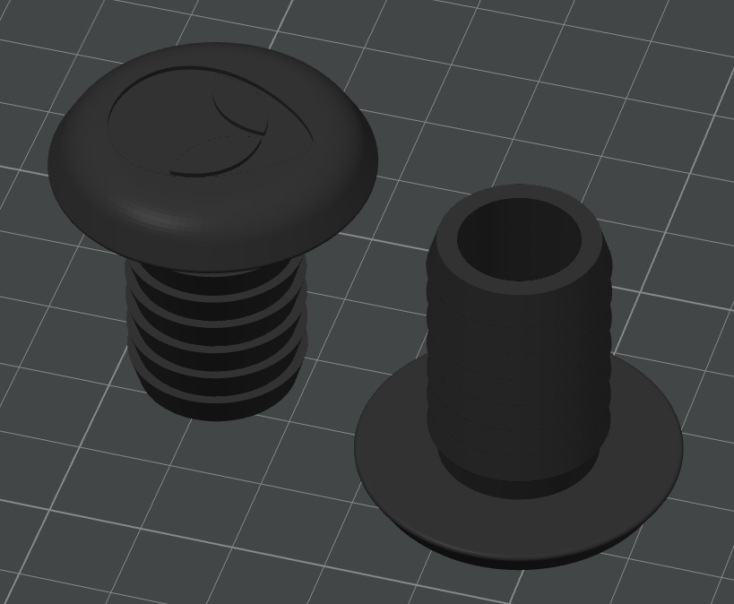
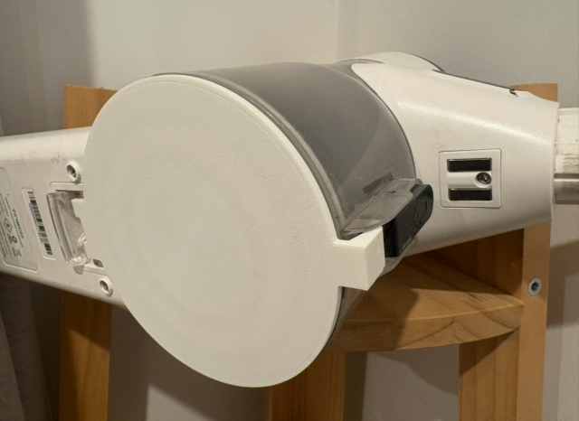
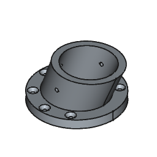
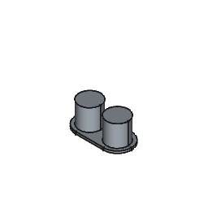
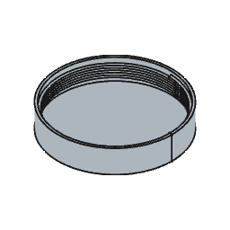
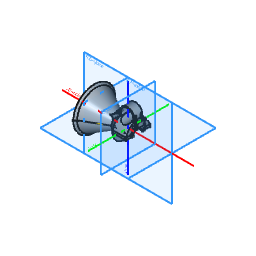
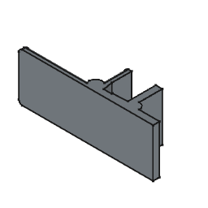
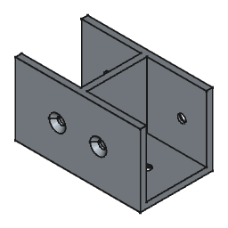
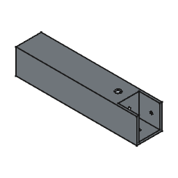
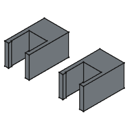

# Miscellaneous 3D printables
Miscellaneous cycling and household items for 3D printing.
Mostly parametric, built with [FreeCad](https://github.com/FreeCAD/FreeCAD)

Ready to print 3MF files could be found next to most of referenced source files.


## Cycling and Scooting
| Preview | Description |
|---------|-------------|
| <br/>**[chainring-guard.FCStd](cycling-and-scooting/chainring-guard/chainring-guard.FCStd)** / [3MF pedals](cycling-and-scooting/chainring-guard/chainring-guard-PedalFacingPart.3mf), [3MF frame](cycling-and-scooting/chainring-guard/chainring-guard-FrameFacingPart.3mf) | Chainring guard with 5 holes for 170 W/ x 44T Crankset |
| <br/>**[standard-bike-bell-lever.FCStd](cycling-and-scooting/bike-bell-clapper/standard-bike-bell-lever.FCStd)** / [bike-bell-clapper.3mf](cycling-and-scooting/bike-bell-clapper/bike-bell-clapper.3mf) | Clapper for standard bike bell |
| <br/>**[18mmPlug.scad](cycling-and-scooting/18mm-handlebar-plug/18mmPlug.scad)** / [plug.3mf](cycling-and-scooting/18mm-handlebar-plug/plug.3mf), [plug-s.3mf](cycling-and-scooting/18mm-handlebar-plug/plug-s.3mf), [18mmPlug06mm.3mf](cycling-and-scooting/18mm-handlebar-plug/18mmPlug06mm.3mf), [18mmPlugAlien.3mf](cycling-and-scooting/18mm-handlebar-plug/18mmPlugAlien.3mf), [18mmPlugSkull.3mf](cycling-and-scooting/18mm-handlebar-plug/18mmPlugSkull.3mf), [18mmPlug06mmAlien.3mf](cycling-and-scooting/18mm-handlebar-plug/18mmPlug06mmAlien.3mf), [18mmPlug06mmSkull.3mf](cycling-and-scooting/18mm-handlebar-plug/18mmPlug06mmSkull.3mf), [18mmPlug06mmVykeenFanArt.3mf](cycling-and-scooting/18mm-handlebar-plug/18mmPlug06mmVykeenFanArt.3mf) | 18mm Handlebar Plug |

## Household
| Preview | Description |
|---------|-------------|
| <br/>**[sheer-eylet.FCStd](household/sheer-eyelet/sheer-eylet.FCStd)** / [sheer-eylet-inner.3mf](household/sheer-eyelet/sheer-eylet-inner.3mf), [sheer-eylet-outer.3mf](household/sheer-eyelet/sheer-eylet-outer.3mf), [sheer-eylet-print-1pc.3mf](household/sheer-eyelet/sheer-eylet-print-1pc.3mf), [sheer-eylet-print-4pcs.3mf](household/sheer-eyelet/sheer-eylet-print-4pcs.3mf) | Sheer Eyelet |
| <br/>**[TinecoPureOneXDustLid.FCStd](household/tineco/TinecoPureOneXDustLid.FCStd)** | Dustbin lid for Tineco Pure One X |
| <br/>**[inline-filter-bracket.FCStd](household/filter-wall-mount-bracket/inline-filter-bracket.FCStd)** | 67mm wall mount bracket for water filter |
| <br/>**[AngledChairHolder.FCStd](household/AngledChairHolder.FCStd)** / [AngledChairHolder-Body002Hole003.3mf](household/AngledChairHolder-Body002Hole003.3mf), [AngledChairHolder-Body002Hole003-wide.3mf](household/AngledChairHolder-Body002Hole003-wide.3mf) | Angled Chair Holder |
| <br/>**[feet.FCStd](household/feet.FCStd)** | Feet |
| <br/>**[filament-clip.FCStd](household/filament-clip.FCStd)** | Filament Clip |
| <br/>**[horn-for-kids-bike.FCStd](household/horn/horn-for-kids-bike.FCStd)** | Horn for kids bike |
| <br/>**[tv-legs.FCStd](household/tv-legs.FCStd)** / [tv-legs-Body.3mf](household/tv-legs-Body.3mf) | TV Legs (works with Toshiba 42HL800AZ) |
| <br/>**[29mm-wood-connector.FCStd](household/wood/29mm-wood-connector.FCStd)** | 29mm wood connector |
| <br/>**[leg-for-29mm-wood.FCStd](household/wood/leg-for-29mm-wood.FCStd)** | Leg for 29mm wood |
| <br/>**[moulding-compensating-desk-clips.FCStd](household/wood/moulding-compensating-desk-clips.FCStd)** | Moulding compensating desk clips |

## Syncing images

Install Gaunt Sloth Assistnant

```bash
npm install gaunt-sloth-assistant -g
```

- Make sure you have API key from your AI provider
- Make sure FreeCAD is installed. 

Start gaunt sloth with `gth code` and ask it to sync previews.

See https://gaunt-sloth-assistant.github.io/docs for details
