# Miscellaneous 3D printables
Miscellaneous cycling and household items for 3D printing.
Mostly parametric, built with [FreeCad](https://github.com/FreeCAD/FreeCAD)

## Cycling
|||
|-|-|
||Chainring guard with 5 holes for 170 W/ x 44T Crankset|
||Clapper for standard bike bell|

## Household
|||
|-|-|
||Sheer Eyelet|
||Dustbin lid for Tineco Pure One X|
||67mm wall mount bracket for water filter|
|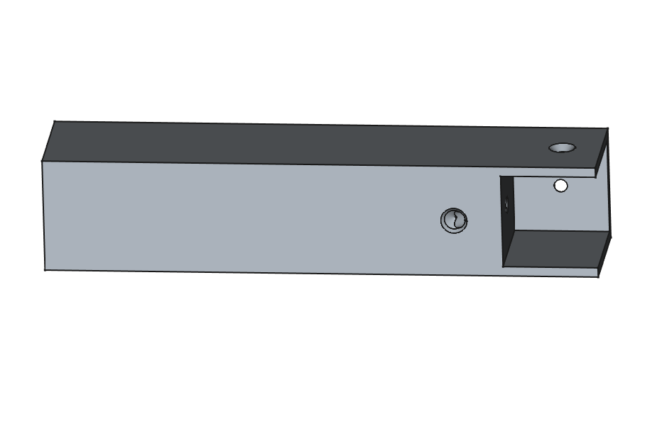|Leg/extension for wooden bar|
|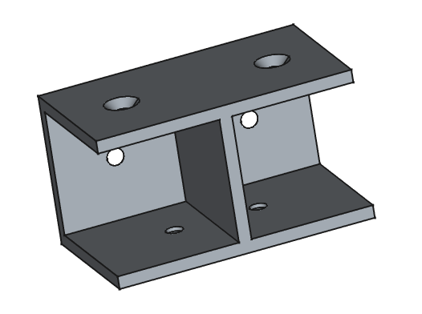|Wooden bar connector|
|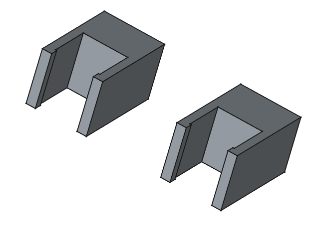|Clips to place between shelf and wall to compensate for wall moulding|
||Angled Chair Holder|
|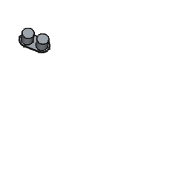|Feet|
||Filament Clip|
|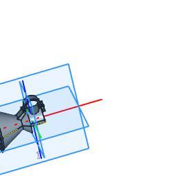|Horn|
|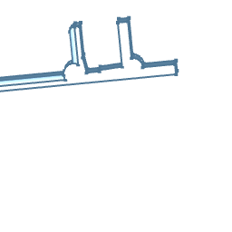|TV Legs|
|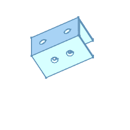|29mm Wood Connector|
||Leg for 29mm wood|
|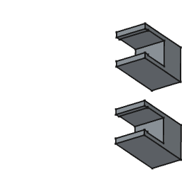|Moulding compensating desk clips|

## Keyboards
|||
|-|-|
|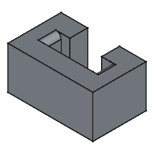|Rubber Band Clip|
|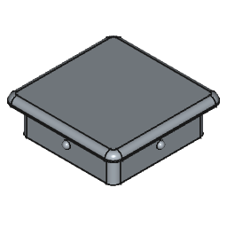|Mechanical keyboard mount hole plug|
|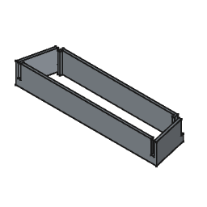|Split keyboard stand clip|
|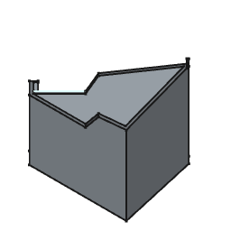|Split keyboard stand|
|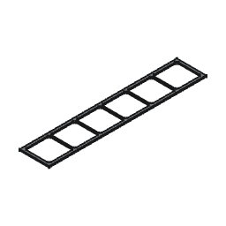|Tiny keyboard experiment stencil|

